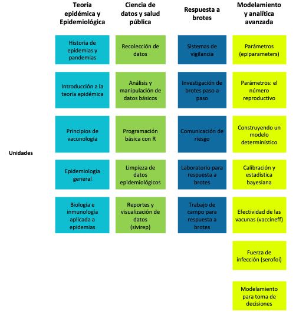

> # `e-Epi-training kit`
>
> ### **Estretegia de entrenamiento en Ciencia de datos en Salud Pública con perspectiva de género**

Proyecto liderado por la [Pontificia Universidad
Javeriana](https://medicina.javeriana.edu.co/trace-lac) Bogotá en el
marco de la iniciativa
[Epiverse-TRACE](https://data.org/initiatives/epiverse/) con el apoyo de
la Universidad de los Andes en Colombia, Data.org y el London School of
Hygiene and Tropical Medicine en Reino Unido. Proyecto patrocinado por
el IDRC de Canadá.

## **Motivación**

La formación en ciencia de datos ha adquirido una relevancia creciente
en el apoyo al manejo y respuesta de emergencias de salud pública, como
las epidemias y pandemias. Sin embargo, en Latinoamérica aún hay
ausencia de material educativo en español adaptado al contexto de
Latinoamérica y el Caribe de acceso libre y gratuito para el aprendizaje
de análisis, modelamiento y respuesta a brotes y epidemias. Además, a
pesar de los esfuerzos de los últimos años para reducir la brecha de
género en las áreas STEM (ciencias, tecnología, ingeniería y matemáticas
por sus siglas en inglés) y la ciencia de datos específicamente,
persisten existe una brecha significativa en la participación y
representación de mujeres en este campo, lo cual limita el potencial de
desarrollo y avance en la salud pública a nivel regional. Este proyecto
promueve la implementación de estrategias educativas innovadoras y
e-learning que desafían las barreras sociales, económicas y de acceso a
educación de calidad promoviendo transversalmente la equidad de género.

## **Objetivo**

Esta estrategia busca cerrar brechas en cuanto al acceso a materiales
educativos y oportunidades de aprendizaje de calidad en análisis,
modelamiento y respuesta a brotes y epidemias en América Latina y el
Caribe, promoviendo el libre acceso y la equidad de género.

## **Antecedentes**

La baja representación de las mujeres en áreas STEM es una preocupación
persistente que requiere de acciones concretas para promover la equidad
de género. En ciencia de datos la participación de mujeres en
comunidades como la de R en 2017 era del 17% y sólo un 9% del total de
autores de paquetes son mujeres. Promover la construcción de equidad de
género en ciencia de datos para salud pública es fundamental para
garantizar una representación diversa, perspectivas enriquecedoras y
estrategias más efectivas en emergencias sanitarias. Por esta razón,
desde el proyecto *Epiverse TRACE-LAC* iniciado a mediados de 2022, se
está construyendo una estrategia e-learning abierta, gratuita y <u>en
español</u> para el entrenamiento en análisis y respuesta a epidemias en
Latinoamérica y el Caribe.

## **¿Contenidos**

Esta estrategia incluye la generación de diversos tipos de contenido
(videos, podcasts, textos e imágenes), la integración de un enfoque de
género, y la promoción del uso de R para abordar los desafíos en la toma
de decisiones.

Para la construcción de la estrategia de entrenamiento e-learning se
tienen contempladas unidades cortas de aprendizaje agrupadas en cuatro
módulos principales:

<table style="width:92%;">
<colgroup>
<col style="width: 20%" />
<col style="width: 70%" />
</colgroup>
<tbody>
<tr class="odd">
<td>
1
</td>
<td>Módulo de Ciencia de datos y Salud pública</td>
</tr>
<tr class="even">
<td>
2
</td>
<td>Módulo de Teoría Epidémica y Epidemiológica</td>
</tr>
<tr class="odd">
<td>
3
</td>
<td>Módulo de Respuesta a brotes</td>
</tr>
<tr class="even">
<td>
4
</td>
<td>Módulo de Modelamiento y analítica avanzada</td>
</tr>
</tbody>
</table>

Cada uno de estos módulos cuenta con varias unidades. Cada unidad tiene
un promedio de duración de trabajo entre 3-5 horas por parte del
estudiante, dependiendo de la ruta de ingreso y conocimientos previos
(ver figura 1)

## Fases del epi-training kit

Se plantearon cuatro fases para el análisis de necesidades, el diseño de
materiales y contenidos, la producción de recursos educativos y el
testeo de unidades para la implementación y evaluación.

### **Fase 1. Exploratoria**

Esta fase tuvo lugar entre Agosto de 2022 a Marzo de 2023. Comprendió el
análisis de necesidades y desafíos de la posible comunidad de usuarios a
través de entrevistas, encuestas y entrenamientos presenciales en zonas
de fácil acceso geográfico en Colombia. Durante esta fase se testó el
contenido teótico-práctico de varias unidades en forma presencial. Esta
fase incluyó trabajo de campo en ciudades como Bogotá, Manizales y Cali.

### **Fase 2. Diseño y desarrollo**

Durante esta fase, que incluye de marzo a noviembre de 2023, se
desarrolla el contenido teórico-práctico en formato online. Esto inlcuye
diseño y desarrollo de materiales como infografías, videos, podcast y
otros.

Asimismo, en esta fase se llevan a cabo testeos de materiales y
contenidos en persona en zonas con menor accesibilidad, tales como
Quibdó. Además de testeo con estudiantes de pregrado en Bucaramanga.

### **Fase 3. Piloto**

En la fase piloto se realizará el testeo de las primeras unidades
online. Esta tendrá lugar entre noviembre de 2022 y mayo de 2023. Esta
contemplará testeos tanto en Colombia como con potenciales usuarios de
otros países en Latinoamérica. Este piloto inlcuye aspectos como
medición de características de materiales de entrenamiento, despliegue
online, enganche, estilo, entre otros. Para el piloto de la estrategia
e-learning se contempla el desarrollo y aplicación de un protocolo de
usabilidad e incorporación de grupos focales.

### **Fase 4. Implementación y evaluación**

Finalmente, en esta fase se implementará se pondrá a disposición el
producto final de manera abierta y gratuita a personas en Latinoamérica
y el Caribe. En elagunos casos podrá acompañar o complementar
entrenamientos presenciales.

Durante esta fase se realizará evaluación de las características de esta
primera versión del e-epi-training kit.

## Perspectiva de género

A lo largo de estas fases, la incorporación de la perspectiva de género
se ha planteado mediante: 1) Preguntar explícitamente aspectos
relacionados a género a los potenciales usuarios identificados; 2)
Identificar barreras de aprendizaje asociadas al género, 3) Promover la
participación de mujeres en el diseño y todas las fases del desarrollo,
4) Retroalimentar el diseño de acuerdo a los resultados preliminares
encontrados.

## Resultados preliminares

Entre agosto de 2022 y julio de 2023 se han realizado seis
entrenamientos y testeos de materiales en terreno que han incluido el
uso de R. Más de 230 estudiantes y profesionales de las áreas STEM y
salud han participado en diferentes regiones de Colombia.

Dentro de estos espacios se ha promovido la formación de mujeres, con
una participación de más del 70%. A través de estos entrenamientos y de
la revisión de literatura, se han identificado elementos que resultan
ser diferenciales en cuanto al género para el aprendizaje de R y ciencia
de datos para salud pública.

En el testeo de contenidos para la estrategia e-learning se han
identificado sesgos de género y la afectación de estos en el logro de
los objetivos de aprendizaje. Esto ha llevado a la elaboración e
implementación de una guía para la transversalidad del enfoque de género
en estrategias e-learning en ciencia de datos y salud pública, y el
diseño de una propuesta de unidad sobre “Datos con perspectiva de género
en salud pública”.

## Contacto

-   [**Zulma M. Cucunubá**](https://github.com/zmcucunuba)**.**
    Investigadora Principal `(zulma.cucunuba@javeriana.edu.co)`

-   [**Laura Gómez-Bermeo**](https://github.com/lgbermeo)**.**
    Coordinadora de entrenamiento `(gomezblaura@javeriana.edu.co)`

-   **Proyecto TRACE-LAC** trace@javeriana.edu.co
